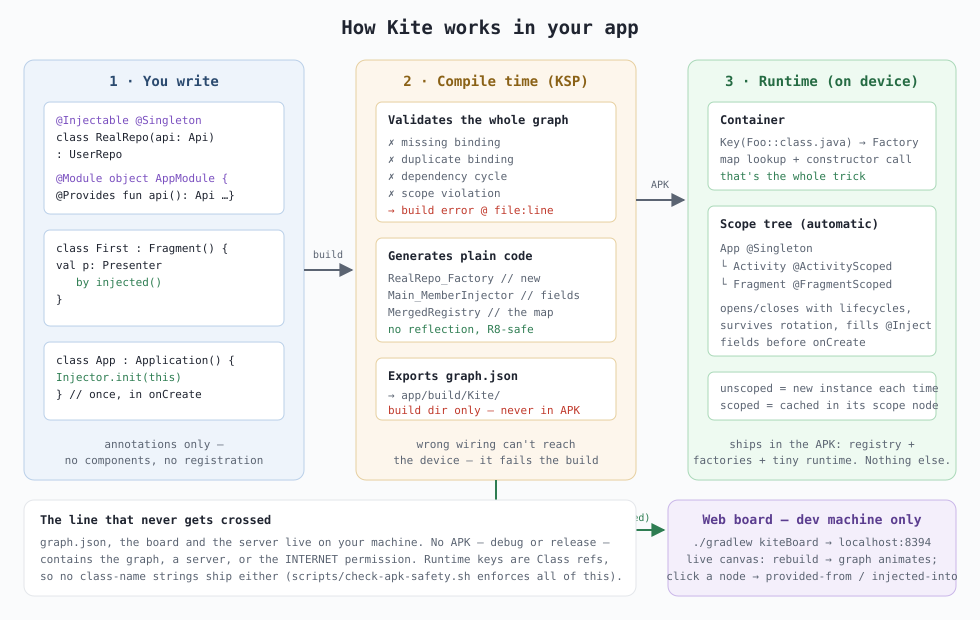

# The 10-minute guide

Everything you need for day-to-day use, on one page. The deep design docs live in
[`sdd/`](sdd/README.md); you should not need them to use the library.

The one idea: **you write classes, the graph writes itself.** Your classes carry no
DI annotations. The processor infers the graph from what your code already says;
the few decisions code can't express live in one file per module — `GraphRules.kt`.



## Setup (once per app)

In every module that participates in the graph (the plugin does the rest — KSP,
dependencies, processor options):

```kotlin
plugins {
    alias(libs.plugins.android.application)   // or android-library
    id("com.kitedi")
}
```

(One prerequisite, usually already true: the KSP plugin on the build classpath —
root `build.gradle.kts`: `alias(libs.plugins.ksp) apply false`.)

In your `Application`, call the **generated** startup façade:

```kotlin
class App : Application() {
    override fun onCreate() {
        super.onCreate()
        Graph.start(this, apiKey = BuildConfig.API_KEY, timeoutMillis = 5_000)
    }
}
```

Where did `apiKey` and `timeoutMillis` come from? See "Graph arguments" below —
they are your own leaf constructor parameters, bubbled up by the processor.

## Provide things — by writing classes

**A class you own** — nothing to do. If something takes it as a constructor
parameter, it is in the graph; its constructor parameters are its dependencies,
and it is one shared instance app-wide (a singleton — like everything in the
graph, see "Lifetimes"):

```kotlin
class Analytics(private val http: HttpClient)
```

**Bind to an interface** — implement it. The sole implementation of a project
interface is bound to it:

```kotlin
interface UserRepo { fun userName(): String }
class RealUserRepo(api: Api) : UserRepo        // UserRepo → RealUserRepo, inferred
```

Two implementations? The build stops and hands you the exact line to paste into
`GraphRules.kt` — `@Bind(UserRepo::class, to = RealUserRepo::class)` — and the
board shows it as a clickable decision card that writes that line for you.

**A type you don't own, or a config value** (OkHttp, a `String`, a timeout) —
just declare the parameter. What nothing provides becomes a **graph argument**:

```kotlin
class HttpClient(cache: RequestCache, timeoutMillis: Long)   // Long? nothing provides it…
```

…so the generated façade gains a parameter: `Graph.start(app, timeoutMillis = …)`.
Same name = same argument everywhere; the parameter name is the identity (this
replaces `@Named` and modules in one move). Construction logic for library types
lives where it belongs — ordinary code before/at the `Graph.start` call site.

## Decisions — GraphRules.kt

One optional file per module (any name; `GraphRules.kt` by convention), committed,
never shipped. The decisions are `@Root`/`@Bind`/`@Scoped` annotations on a holder
object, written with **compile-checked class references**, not strings:

```kotlin
import com.kite.di.rules.Bind
import com.kite.di.rules.Root
import com.kite.di.rules.Scoped

// a *plain* class resolved only at runtime (`by injected()` / Kite.get) — inference
// can't see call sites (a class behind an interface needs no root: R1 already included it)
@Root(LegacyTracker::class)
// choose among multiple implementations
@Bind(PaymentGateway::class, to = StripeGateway::class)
// lifetimes beyond the default singleton: "activity" | "fragment" | "none" | a custom "<Name>" (needs a level)
@Scoped(SessionState::class, "activity")
@Scoped(SessionCart::class, "Session", level = 10)
private object GraphRules
```

A typo'd class is an ordinary unresolved reference — the IDE marks it red before the
build runs and refactorings keep it current, so the file can't rot. The annotations
are `SOURCE`-retention + `compileOnly`: nothing here reaches the APK (SDD doc 10).

One decision lives on the class instead of the holder: `@Fresh` — a new instance
per injection (see "Lifetimes"). "Never shared" is part of a class's own
contract, so it belongs where the class is read.

## Multi-module apps

Apply the same plugin in every module that has graph classes — and only those:
the repo's demo is cut like a production app (`:app` shell, `:core:network`,
`:core:analytics`, `:core:designsystem`, and clean-architecture features
`:feature:profile:api`/`:impl`, `:feature:orders:api`/`:impl`), and the design
system and pure-contract `:api` modules carry no plugin at all — nothing there
is injectable. The app module's generated `Graph.start` covers them all. What
crosses module boundaries:

- **Interface implementations travel free — even across an api/impl split.**
  `:feature:profile:impl`'s `NetworkUserRepository : UserRepository` binds to
  the interface from `:feature:profile:api` and is injectable in `:app` with
  zero ceremony — a module exports its implementations and everything their
  constructors pull in.
- **Exporting a plain class is a decision; exporting an interface is free.** A
  *plain* class consumed only by other modules isn't in its own module's inferred
  graph — add `@Root(Foo::class)` to the **owning** module's `GraphRules.kt`, the
  same rule as for `by injected()`: a root declares consumers the compiler can't
  see. Put the class behind an interface instead and the question disappears — R1
  binds and exports it on the spot. That is why the demo's `:core:network` carries
  no rules file at all, and `:core:analytics`'s holds a single line: the `@Bind`
  choosing between its two `Analytics` implementations.
- **Decisions live with the owner.** `@Scoped`/`@Bind` for a `:core:network`
  class belong in `:core:network`'s `GraphRules.kt` — the build tells you so if
  you put them elsewhere, and an ambiguity consumed from `:app` sends you to the
  owning module's rules file.
- **Graph arguments unite.** An `apiKey: String` leaf in any module becomes the
  single `Graph.start(apiKey = …)` parameter.
- **One board.** All modules render on one canvas; each module is a labeled
  container (a translucent backdrop around its nodes) in its own accent color —
  toggle with the **Modules** button or `m`.

Scope violations across modules are still build errors, and cross-module
dependency *cycles* can't even be expressed — Gradle forbids circular project
dependencies. One current limit: `Set<I>` collects implementations per module.

## Inject things

| Where you are | How you inject |
|---|---|
| A class Kite creates | Just declare constructor parameters |
| Activity / Fragment | `private val presenter: Presenter by injected()` (a plain class with no interface also needs `@Root`) |
| ViewModel | generated adapter: `private val counter by counterViewModel()` |
| @Composable | `injected<Analytics>()` and generated `rememberCounterViewModel()` |
| Custom View | `private val analytics: Analytics by injected()` — resolves in the host Activity's scope |
| Service / BroadcastReceiver | `context.injected<Analytics>()` (host Activity's scope if any, app scope otherwise) |
| Anywhere else | `Kite.get<Analytics>()` (app scope) |

```kotlin
class FirstFragment : Fragment() {
    private val presenter: FirstPresenter by injected()   // resolves in this fragment's scope
}
```

## Lifetimes (scopes)

The default: **everything is a singleton** — one shared instance per app
process, created on first use. Implementation, presenter, helper — if it is in
the graph, it is shared. You never think about lifetime until you need a
different one.

The rare opposite — a class that must be built anew for every consumer — is
worth seeing right at the class, so the decision lives there:

```kotlin
import com.kite.di.rules.Fresh

@Fresh   // a new instance every time it is injected — never shared
class DefaultGreetingUseCase(private val repository: UserRepository) : GreetingUseCase { … }
```

Everything else is a `@Scoped` decision in `GraphRules.kt`:

| Lifetime | One instance per | Cleared |
|---|---|---|
| singleton *(the default — nothing to write)* | app process | never |
| `@Fresh` on the class *(or `@Scoped(X::class, "none")`)* | injection | — |
| `"activity"` | Activity — **survives rotation** | when the Activity truly finishes |
| `"fragment"` | Fragment instance | when the Fragment is destroyed |
| custom `"<Name>", level = N` | your custom scope | when you `close()` it |

One class, one lifetime decision — deciding it twice is a build error, and
`@Scoped(X::class, "singleton")` earns a warning: singleton is the default, so
the line says nothing.

Scopes open and close by themselves with the Android lifecycle. The compiler
enforces direction: something long-lived may not depend on something
shorter-lived (singleton ← activity is a build error, not a runtime surprise).

### Custom scopes

For a lifetime the built-ins don't cover (a login session, a checkout flow) —
declare it with its own level (levels order lifetimes; sharing a level with
another scope is a build error; built-ins use 0, 1, 2):

```kotlin
@Scoped(SessionCache::class, "Session", level = 10)
```

Open and close the scope yourself; resolve through the handle (it also works as
`owner` in `Kite.get`):

```kotlin
val session = Kite.openScope(ScopeId("session"), name = "Session", level = 10)
val cache: SessionCache = session.get()
…
session.close()   // drops the scope's instances (ScopeHandle is a Closeable)
```

## androidx ViewModels

A ViewModel is an **entry point**: the processor sees the `ViewModel` supertype
and generates a `<name>ViewModel()` adapter for Activities and Fragments. The
androidx `ViewModelStore` owns the instance (rotation retention, `onCleared`);
the graph fills the constructor. Graph scopes never apply — the store is the cache.

```kotlin
class CounterViewModel(private val analytics: Analytics) : ViewModel() {
    var clicks = 0; private set
    fun onFabClick() { clicks++; analytics.track("fab_clicks:$clicks") }
}

class MainActivity : AppCompatActivity() {
    private val counter: CounterViewModel by counterViewModel()   // generated, survives rotation
}
```

Runtime arguments need no "assisted injection" — an unprovidable ViewModel
parameter simply becomes an adapter parameter, and `SavedStateHandle` is
supplied automatically:

```kotlin
class CheckoutViewModel(flow: CheckoutFlow, orderId: String, saved: SavedStateHandle) : ViewModel()

// in the fragment:
private val vm by checkoutViewModel(orderId = args.orderId)
```

## Jetpack Compose

Apply the Compose compiler plugin as usual — the Kite plugin notices and does
the rest (adds the `kite-compose` helpers, and every ViewModel adapter gains a
`@Composable remember…` form). Same graph, no extra concepts:

```kotlin
@Composable
fun SecondScreen() {
    val analytics = injected<Analytics>()                       // graph value, host Activity's scope
    val greeting = rememberGreetingViewModel(name = "Compose")  // generated; store-retained
    val taps by greeting.taps.collectAsState()
    Button(onClick = { greeting.onTap(); analytics.track("tap") }) { Text("Taps: $taps") }
}
```

The nearest `LocalViewModelStoreOwner` (NavBackStackEntry, Fragment, Activity)
retains the ViewModel; `SavedStateHandle` and runtime arguments work exactly like
in the Activity/Fragment adapters. In previews (no Activity), `injected()` falls
back to the app scope.

## Defer or re-create → `Lazy<T>` / `() -> T`

Plain standard-library types — no framework import at the injection site:

```kotlin
class Editor(
    private val parser: Lazy<HeavyParser>,   // kotlin.Lazy: created on first .value, then cached
    private val cursors: () -> Cursor,       // a fresh Cursor per call (Cursor is @Fresh)
)
```

The framework's `Provider<T>` / `Lazy<T>` work identically if you prefer explicit
types (`Provider<T>` *is* a `() -> T`). Either form also breaks constructor
cycles: `A → B → () -> A` is legal.

## Optional dependencies → default values

A parameter with a default value is optional: if the type has a binding, it is
injected; if not, the default is used — no build error, and it never becomes a
graph argument.

```kotlin
class Uploader(
    private val http: HttpClient,
    private val retries: Int = 3,     // no Int binding → 3 is used
)
```

## The plugin pattern → `Set<I>`

Implement the interface anywhere; inject the whole collection. Adding an
implementation requires touching no other file — it joins the set (and the board)
automatically:

```kotlin
interface StartupTask { val name: String; fun run() }

class WarmUpCacheTask(cache: RequestCache) : StartupTask { … }
class TrackLaunchTask(analytics: Analytics) : StartupTask { … }

class AppInitializer(private val tasks: Set<StartupTask>) {
    fun runAll() = tasks.forEach { it.run() }
}
```

Need to pick one by name (the strategy pattern)? The key lives on the interface —
no `@IntoMap`, no framework concept:

```kotlin
interface PayloadParser { val format: String; fun parse(raw: String): String }

class Decoder(private val parsers: Set<PayloadParser>) {
    fun decode(format: String, raw: String) =
        parsers.first { it.format == format }.parse(raw)
}
```

## When you get it wrong

Everything is validated at **build time** with the file and line of both sides:
missing bindings, ambiguous implementations (with the ready-to-paste `@Bind`
line and a board decision card), duplicates, cycles, and scope violations.
A rule that names a class that no longer exists can't even compile. Nothing
reaches the device.

## See your graph

Every debug build prints a link and starts the board for you:

```
> Task :app:kiteBoard
  Dependency board: http://localhost:8394  (starting server…)
```

Open the link. Rebuild in Android Studio and watch the board animate the change —
the server keeps running and picks up each new build. Click any node to see where
it's **provided from** and where it's **injected**; graph arguments show up as
external nodes (`apiKey: String`), ViewModels as entry points, and blocked builds
surface as clickable **decision cards** that write `GraphRules.kt` for you.

The server auto-starts only on a real build/install/run (never during `test`), and
never under CI. To manage it yourself:

```
./gradlew kiteBoard                       # start it by hand
./gradlew :app:assembleDebug -Pkite.startBoard=false   # print the link, don't start
./gradlew :app:assembleDebug -Pkite.boardPort=9000     # a different port
```

This all stays on your machine — no APK ever contains the graph, a server, or the
INTERNET permission.

## Testing

Constructor injection means plain unit tests need no framework at all:

```kotlin
val presenter = DefaultFirstPresenter(DefaultGreetingUseCase(FakeRepo()), SessionState())
```
